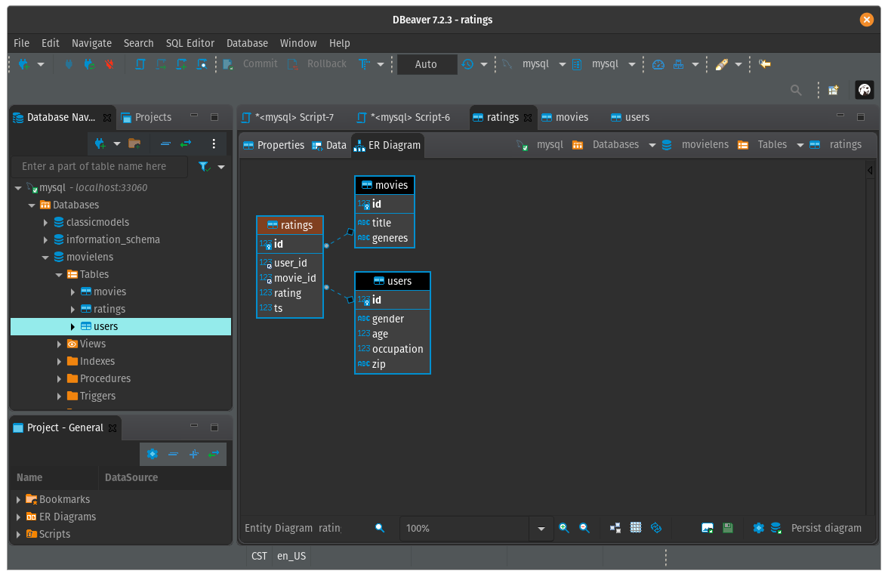
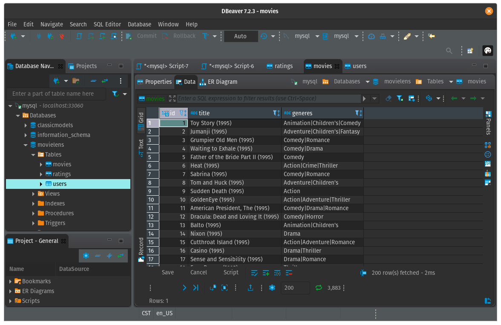
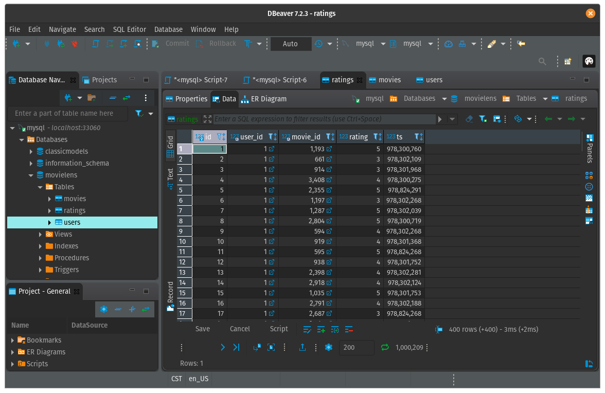
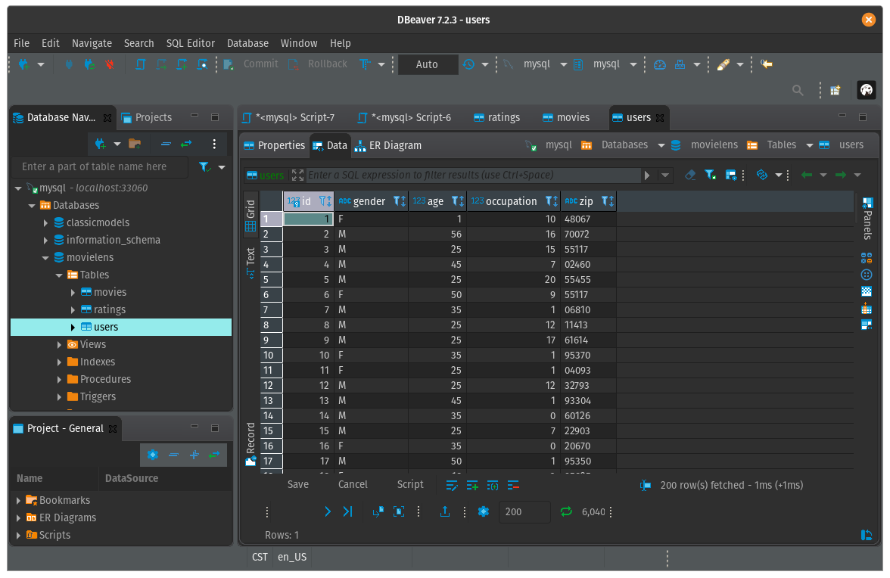
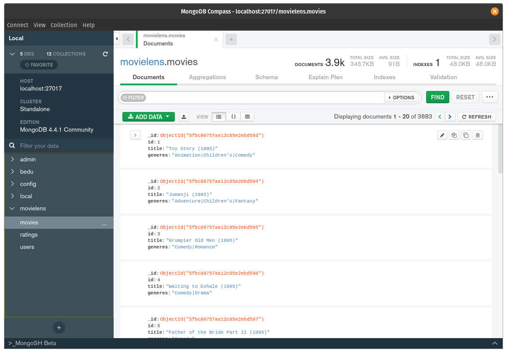
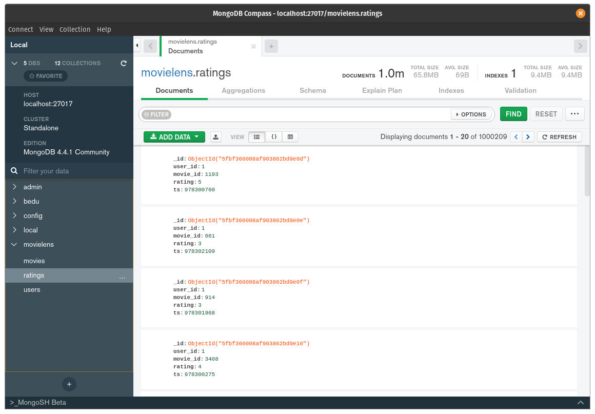
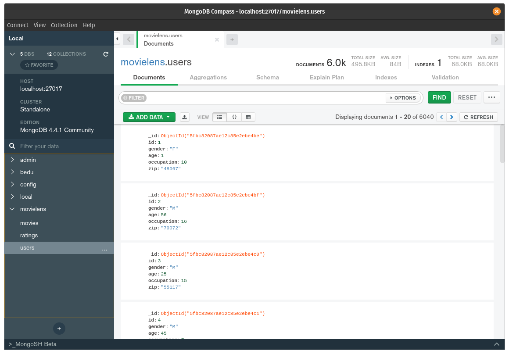

# Evidencias - Sesion 07

`Autor: Luis Castillo`

## Reto 01

**Q:** Definir los campos y crear las tablas para los datos de `movies` y `ratings`.

**A:** A continuación se presenta el script SQL para crear las tablas en base a los datos proporcionados. Como extra se creo la tabla de `users`.

```
CREATE TABLE IF NOT EXISTS movies (
	id INT NOT NULL,
	title VARCHAR(255),
	generes VARCHAR(255),
	PRIMARY KEY movies(id)
);

CREATE TABLE IF NOT EXISTS users (
	id INT PRIMARY KEY,
	gender varchar(1),
	age INT,
	occupation INT,
	zip varchar(20)
);

CREATE TABLE IF NOT EXISTS ratings (
	id INT NOT NULL AUTO_INCREMENT,
	user_id INT,
	movie_id INT,
	rating INT, 
	ts BIGINT,
	PRIMARY KEY ratings(id),
	FOREIGN KEY (user_id) REFERENCES users(id),
	FOREIGN KEY (movie_id) REFERENCES movies(id)
);
```


También se añade el diagrama de relacional de entidades de las tablas




## Reto 02

**Q:** Utilizando los archivos `.dat`, realizar limpieza de datos y poblar con los datos las tablas de `movies` y `ratings`.

**A:** Para realizar la limpieza de datos se utilizo un editor de texto para reemplazar al delimitador original de los datos (`::`) por uno que permitiera realizar la importación de datos de forma mas sencilla, en este caso se opto por el delimitador `;`, previamente reemplazando la conciencia de este carácter dentro del dataset original. A continuación se presentan evidencias de la importación de los datos.

**Movies**



**Ratings**



**Users**




## Reto 03

**Q:** Se deberá de crear colecciones e importar los datos de los archivos `movies.csv` y `ratings.csv`.

**A:** A continuación se presentan evidencias de la carga de los datos en una instancia local de MongoDB utilizando Compass.

**Movies**



**Ratings**



**Users**

